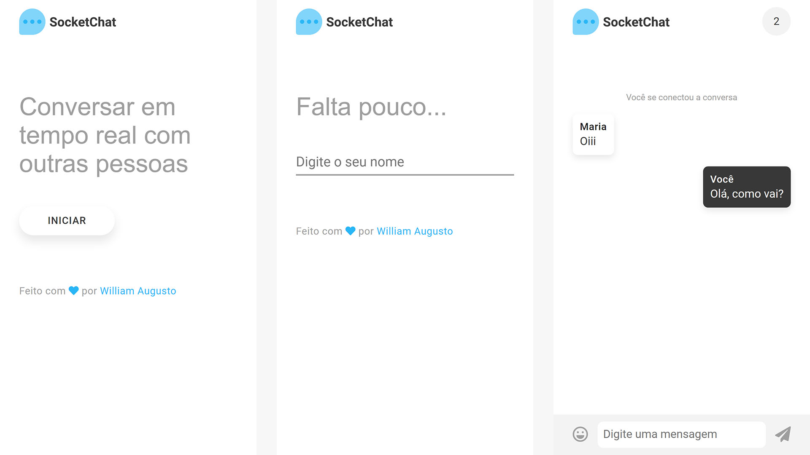
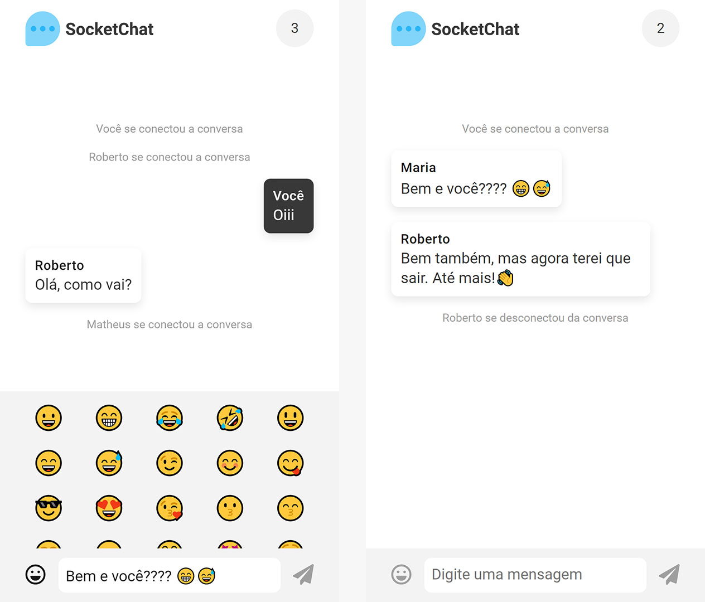

<p align="center">
    
<p>
<p align="center">Converse em tempo real com outras pessoas</p>

<p align="center">
    
    
<p>

## Sobre

Em busca de um melhor proveito de meus estudos, decidi criar um aplicativo web que se atualizasse a cada interação com o backend, ou seja, que fosse em tempo real. Portanto, me deparei com Socket.io, uma biblioteca que me permitiu criar um bate papo (chat) em tempo real e com NodeJS ao lado do servidor.

## Funcionalidades

- Escolher o seu nome;
    - Antes do nome ser autorizado, é feito uma validação para verificar se ele já está sendo usado.
- Enviar mensagens;
- Enviar emoticons/emojis;
- Obter a contagem de usuários;
- Ler o log de cada entrada/saída de usuários.

## Instalação

### Pré-requesitos

Para o projeto ser executado, é necessário possuir NodeJS instalado em sua máquina, sendo de preferência, a versão mais recente.

### Início

É necessário apenas instalar as depêndencias de NodeJS, e pra isso basta apenas:

```
npm install
```
ou
```
npm i
```

### Configuração de porta e URL

Por padrão, o endereço do servidor é **http://127.0.0.1** com a porta **8080**, portanto: **http://127.0.0.1:8080**.
Caso queira altera-las, acesse o arquivo **index.js** e modifique as constantes **port** e **url**. Como no exemplo abaixo:

```
const port = process.env.PORT || 8080
const url = `http://127.0.0.1:${port}/`
```

Apenas isso é necessário para a comunicação entre Socket.io e NodeJS.

### Construído em

- **NodeJS** - Servidor;
- **ExpressJS** -  Framework de NodeJS;
- **EJS** - Kayout em NodeJS para marcação;
- **Socket io** - Comunicação em tempo real com o servidor;
- **Javascript** - Realização de funções ao lado do cliente;
- **CSS** - Estilização da aplicação.

### Despedida

Obrigado por visitar meu projeto, você é livre para dar um feedback ou usa-lo como referência para os seus projetos. Obrigado, até mais! 😊

📧 william.santos315@outlook.com